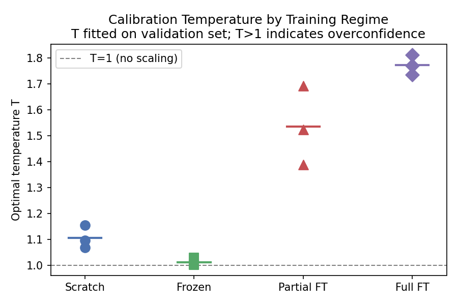
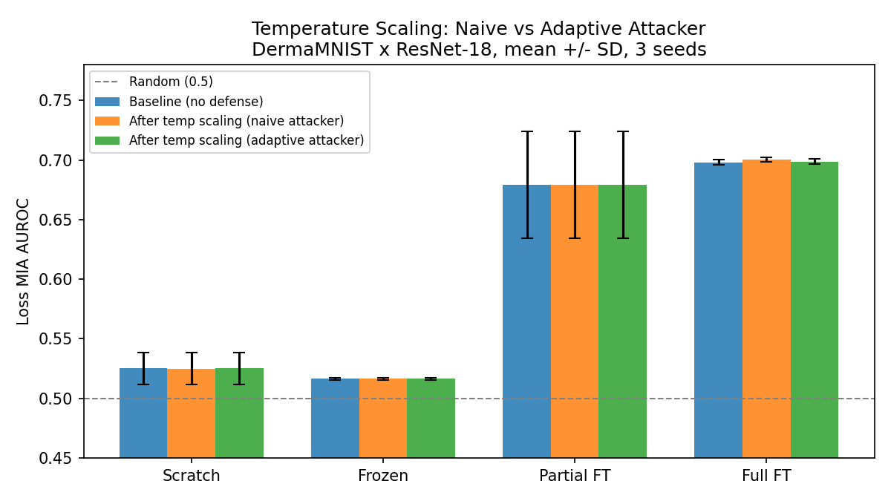

# Does Post-hoc Temperature Scaling Reduce Membership Leakage?

Follow-on to [Project 1](https://github.com/sai-katari/medical-membership-privacy),
which showed that fully fine-tuned ResNet-18 models on DermaMNIST leak membership
information (loss-MIA AUROC = 0.698) and that at low FPR, raw float32 outputs showed higher entropy TPR than loss TPR
(3.4% vs ~0% at 1% FPR); this gap is sensitive to output precision and tie-breaking
and should not be interpreted as uniquely additional entropy-based membership signal.

The question here is whether temperature scaling -- applied after training, no
retraining needed -- removes that membership information or reduces it in any
meaningful way.

## Research question

Does post-hoc temperature scaling reduce membership leakage, and is any reduction
robust to adaptive attackers?

## What I tested

Temperature scaling fits a scalar T on the validation set that divides the logits
before softmax. Higher T produces softer, higher-entropy predictions. It takes a
few seconds to apply and does not change the model's argmax predictions.

Three attacker types:

| Attacker | Knows calibration was applied? | Knows T? | Method |
|----------|-------------------------------|----------|--------|
| Naive | No | No | Standard loss/confidence/entropy attacks on scaled outputs |
| Adaptive | Yes | Yes | Exact log-space inversion, then standard attacks |

An intermediate "semi-adaptive" attacker was implemented but excluded from
headline results: its NLL-based T estimator is not identifiable (see
Limitations), so its outputs are diagnostic only.

Exact inversion is valid when the attacker receives a complete, full-precision
probability vector and knows T. Under rounding, quantization, top-k truncation,
or label-only output, exact inversion may no longer be possible. Evaluating
membership privacy under those restricted-output settings requires separate attack
models and is left for future work.

## Setup

```bash
pip install -r requirements.txt
```

At the start of each session, restore the DermaMNIST cache:

```python
import shutil, os
os.makedirs("/root/.medmnist", exist_ok=True)
shutil.copy("/your/drive/dermamnist_224.npz", "/root/.medmnist/dermamnist_224.npz")
```

## Running the pipeline

```bash
python scripts/collect_baseline.py     --config configs/baseline.yaml --p1_dir /path/to/project1
python scripts/fit_temperature.py      --config configs/baseline.yaml --p1_dir /path/to/project1
python scripts/run_naive_attacks.py    --config configs/baseline.yaml
python scripts/run_adaptive_attacks.py --config configs/baseline.yaml
python scripts/analyze_results.py      --config configs/baseline.yaml
```

Sanity audit before looking at results:

```bash
python scripts/sanity_audit.py
# 42 checks, 0 failures
```

## Results

### Temperature values

T fitted by minimising NLL on the validation set only:

| Regime | T (mean +/- SD, 3 seeds) |
|--------|--------------------------|
| Frozen | 1.012 +/- 0.015 |
| Scratch | 1.107 +/- 0.044 |
| Partial FT | 1.535 +/- 0.152 |
| Full FT | 1.773 +/- 0.038 |

The fitted temperature increased across progressively more heavily fine-tuned
regimes, mirroring the leakage ordering from Project 1.



### Calibration

Temperature scaling improved ECE in scratch, partial-FT, and full-FT models
while leaving frozen-model calibration essentially unchanged:

| Regime | ECE before | ECE after | delta ECE |
|--------|-----------|-----------|-----------|
| Frozen | 0.018 | 0.018 | 0.000 |
| Scratch | 0.036 | 0.019 | -0.017 |
| Partial FT | 0.078 | 0.039 | -0.039 |
| Full FT | 0.088 | 0.050 | -0.038 |

### Loss MIA AUROC (mean +/- sample SD, 3 seeds)

| Regime | Baseline | Naive (scaled) | Adaptive (known T) |
|--------|----------|----------------|--------------------|
| Frozen | 0.516 +/- 0.001 | 0.516 +/- 0.001 | 0.516 +/- 0.001 |
| Scratch | 0.525 +/- 0.013 | 0.525 +/- 0.013 | 0.525 +/- 0.013 |
| Partial FT | 0.679 +/- 0.045 | 0.679 +/- 0.045 | 0.679 +/- 0.045 |
| Full FT | 0.698 +/- 0.002 | 0.700 +/- 0.002 | 0.699 +/- 0.002 |

### Entropy MIA AUROC and TPR @ 1% FPR

| Regime | Entropy AUC base | Entropy AUC scaled | TPR@1% base | TPR@1% scaled | Paired delta |
|--------|-----------------|-------------------|-------------|---------------|--------------|
| Frozen | 0.504 +/- 0.001 | 0.504 +/- 0.001 | 0.010 +/- 0.001 | 0.010 +/- 0.001 | -0.000 +/- 0.000 |
| Scratch | 0.510 +/- 0.007 | 0.510 +/- 0.006 | 0.010 +/- 0.001 | 0.010 +/- 0.001 | +0.000 +/- 0.001 |
| Partial FT | 0.675 +/- 0.048 | 0.674 +/- 0.048 | 0.015 +/- 0.003 | 0.017 +/- 0.003 | +0.001 +/- 0.000 |
| Full FT | 0.697 +/- 0.002 | 0.698 +/- 0.001 | 0.034 +/- 0.003 | 0.036 +/- 0.005 | +0.002 +/- 0.003 |



### What the results show

Temperature scaling substantially improves calibration but does not materially
reduce membership leakage. The naive loss MIA AUC is essentially unchanged after
scaling across all four regimes -- the largest movement is full FT going from
0.698 to 0.700. Entropy attacks tell the same story: the paired TPR@1% change for
full FT is +0.0016 +/- 0.0028 across three seeds, indicating no consistent
reduction across runs.

The known-T adaptive attack recovered approximately the original AUC in all cases.
For full FT the adaptive AUC is 0.699 vs the baseline 0.698. Membership information
is preserved in the scaled distribution and is recoverable given T and full-precision
outputs.

Semi-adaptive results are not reported as findings. The NLL-based T estimator
has a structural identifiability problem: the scaled output is already
approximately NLL-optimal on data from the same distribution as the shadow set,
so the estimator finds T_hat ~= 1 regardless of T_true. A proper semi-adaptive
attacker requires independently trained shadow models with known membership
splits -- that is future work. The headline conclusion does not depend on this
attacker since the naive attack already shows temperature scaling does not
reduce leakage.

Improved calibration and improved membership privacy are not equivalent properties.

## Sanity checks

- Known-T inversion: max reconstruction error < 4e-16 in float64 synthetic tests;
  on stored float32 outputs the error is ~3e-7, within float32 precision and not
  affecting attack results. (Synthetic round-trip check only.)
- Sample ordering: baseline and scaled attack pools have identical ordering (all 12 runs)
- Calibration metrics computed on 2005 non-members (test set) only
- ddof=1 throughout (verified by static grep)
- TPR computed consistently via roc_curve with fpr <= target_fpr

## Limitations

Exact inversion relies on receiving a complete, full-precision probability vector
and knowing T. In deployed systems that round or quantize probabilities, truncate
outputs to top-k predictions, or provide only predicted labels, exact inversion
may no longer be possible. Evaluating membership privacy under those
restricted-output settings requires separate attack models and is left for future
work.

The semi-adaptive estimator has a structural identifiability problem, not a
tuning problem: NLL minimisation on honestly labeled shadow data prefers the
defender's already-calibrated output (T_hat ~= 1). No grid refinement fixes
this. A proper implementation requires disjoint shadow data and independently
trained shadow models.

This study covers one dataset (DermaMNIST) and one architecture (ResNet-18).
The conclusion that temperature scaling does not provide measurable membership-
privacy protection applies to this experimental setting.

## Connection to Project 1

Project 1: which fine-tuning regimes leak membership information, and why?
Project 2: does post-hoc calibration reduce that leakage?

The entropy-attack finding from Project 1 -- that entropy exposed additional
membership signal in full-FT models at low FPR -- motivated this study. The
entropy results here show that temperature scaling does not reduce that
membership-relevant entropy signal in a meaningful way: entropy TPR@1% FPR
changes by +0.0016 +/- 0.0028 for full FT, providing no evidence of a
systematic reduction.

## Related work

Chen and Pattabiraman (NDSS 2024) mitigate membership inference by enforcing
less confident predictions during training (HAMP). The finding here is the
post-hoc counterpart: softening confidence after training improves calibration
but leaves the membership ordering intact, and an attacker with T recovers the
original leakage exactly. Together these suggest the timing of the defense
matters more than whether outputs look less confident.

## References

Guo et al. On Calibration of Modern Neural Networks. ICML 2017.
Shokri et al. Membership Inference Attacks Against Machine Learning Models. IEEE S&P 2017.
Yeom et al. Privacy Risk in Machine Learning: Analyzing the Connection to Overfitting. CSF 2018.
Carlini et al. Membership Inference Attacks From First Principles. IEEE S&P 2022.
Chen and Pattabiraman. Overconfidence is a Dangerous Thing: Mitigating
  Membership Inference Attacks by Enforcing Less Confident Prediction. NDSS 2024.
Yang et al. MedMNIST v2. Scientific Data 2023.

## Author

Sai Katari -- M.S. in Computer Science, University of Kansas.
GitHub: [sai-katari](https://github.com/sai-katari)

## License

MIT -- see [LICENSE](LICENSE).
